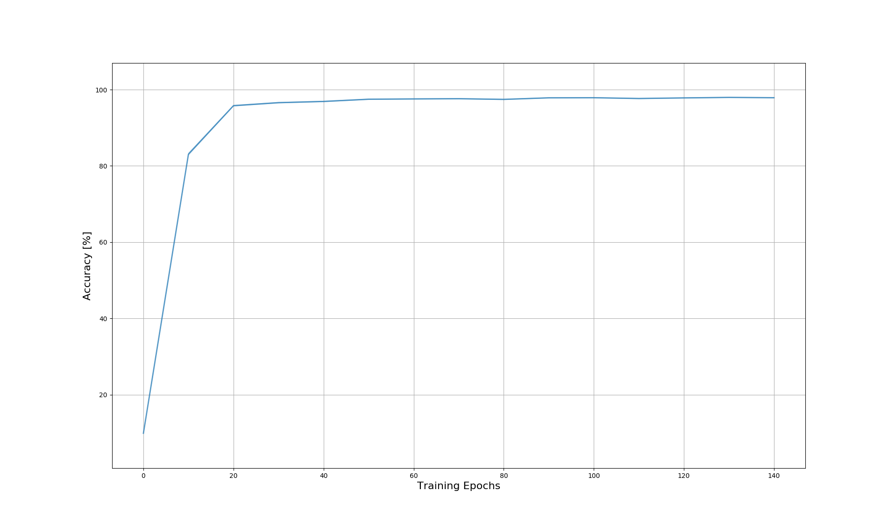

# A Tensorflow implementation of the "Recurrent Attention Model"

The **Recurrent Attention Model** (RAM) is introduced in [1]. 

It is inspired by the way humans perceive their surroundings, i.e. focusing on selective parts of the 
environment to acquire information and combining it, instead of observing the scene in its entirety.

In [1], the performance of the model is demonstrated by calssifying the [MNIST](http://yann.lecun.com/exdb/mnist/) dataset.
In contrast to the existing approaches that processes the whole image, the **RAM** uses the information of *glimpses* at selected locations. 
These *glimpses* are then perceived in a retina-like representation to classify the given symbols.

As suggested in [1], the **action network** is trained by optimizing the cross entropy loss, 
while the **location network** is trained with reinforcement learning using the REINFORCE [2] learning rule. 
The **baseline network** is trained by reducing the mean squared error between the baseline and the recieved reward.

The code is inspired by [3] & [4].

## Installation
**Required packages:**
1. [Numpy](http://www.numpy.org/)
2. [Tensorflow](https://www.tensorflow.org/)
3. [OpenCv](https://opencv.org/) for evaluation
4. [Matplotlib](http://matplotlib.org/) for plotting
5. [H5Py](http://www.h5py.org/) for saving the trained network weights

Install the packages via `pip`.

```
pip install numpy tensorflow opencv-python matplotlib json
```

## Usage
The parameters for the training are all defined in the configuration files 
`run_mnist.py` and `run_translated_mnist.py`.


After training, the network-model is 
saved. It can be loaded for further training or evaluation.

## Evaluation
During training information about the current losses, accuracy 
and the behavior of the location network can be viewed using `tensorboard`. 
```
tensorboard --logdir=./summary
```

To create images of the glimpses that the network uses after training, simply execute the evaluation script.
The first parameter is the name of the configuration file and the second is the path to the network model.
```
evaluate.py run_mnist ./model/
```

To plot the accuracy of the classification over the number of trained epochs use the plotting script. 
```
python plot.py ./results.json
```

## Classification of the standard MNIST dataset
To train the network on classifying the standard MNIST dataset, 
start the training via the corresponding configuration file:
```
python run_mnist.py
```
The chosen parameters are the same as in [4].

**Current Highscore:  98.09% +/- 0.137 accuracy on the MNIST test-dataset.**

The plot below shows the accuracy for the test-dataset over the number of trained epochs. 


Examples of the images and the corresponding glimpses used by the network are displayed in the table.
 
|Originial Image | Glimpse 0| Glimpse 1| Glimpse 2 |Glimpse 3|
|:--:|:--:|:--:|:--:|:--:|
||||||
||||||

--------
[1] Mnih, Volodymyr, Nicolas Heess, and Alex Graves. "Recurrent models of visual attention." Advances in neural information processing systems. 2014.

[2] Williams, Ronald J. "Simple statistical gradient-following algorithms for connectionist reinforcement learning." Machine learning 8.3-4 (1992): 229-256.

[3] https://github.com/jlindsey15/RAM

[4] http://torch.ch/blog/2015/09/21/rmva.html

